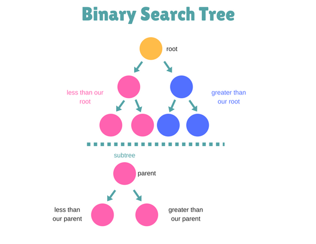

# Binary Search Tree

## Introduction
Trees are like linked lists. Both have nodes that connect by pointers. But a tree can connect to multiple different nodes. Nodes represent value and are connected by edges. The nodes are organized into levels. The original node in a Tree is called the root. A node that has other nodes connected to it is called a parent node. The nodes connected to the parent node is called a child node. Sibling nodes are nodes that share the same parent node. Leaf nodes are nodes that don’t have any children nodes. The nodes that are to the left or right of a parent node form a sub tree. 

## Binary Search Trees
A binary tree is a tree where each node can have up to two child nodes. A Binary Search Tree (BTS) is a binary tree that has rules that must be followed for the data that is put in the tree. In a BST each node is greater than every node in its left sub tree. Which also means each node is less than every node in its right subtree. 


 

Binary Search Trees have a lot of advantages. One advantage being speed. A developer can inert, delete, and traverse a BST in O(log n) speed. 

## Inserting in a Binary search Tree
To insert into a BST start at the root. Then you always insert the new node as a leaf. First start with the root node and compare the value of the new node to determine if it needs to be inserted to the left or the right. If the new node is less that the root node it moves to the left subtree. Continue to compare the node to each child node until the new node can be inserted as a leaf. 

## Traversing a Binary Search Tree
To find a specific node is similar to inserting a node. First start at the root. Compare the first node to designated node, if the node is greater than the root node move to the right sub tree and continue comparing nodes moving either left or right down the tree to find the specific node. 

## Deleting a node
If a node is a leaf it can be deleted from the tree easily without affecting the rest of the tree. If a node has one child, the child after the deleted node replaces the node. When deleting a node with two children. Find the next higher node to delete the node. The delete function happens recursively to replace desired nodes. 

Common BST Operation | Description 
-------- | -------- 
insert(value) | Insert a value into the tree.
remove(value) | Remove a value from the tree.
contains(value)| Determine if a value is in the tree.
traverse_forward| Visit all objects from smallest to largest.
traverse_reverse | Visit all objects from largest to smallest.
height(node) | Determine the height of a node. If the height of the tree is needed, the root node is provided.
size() | Return the size of the BST.
empty() | Returns true if the root node is empty. This can also be done by checking the size for 0.


## Example Problem: Write a Python program to delete a node with the given key in a given Binary search tree (BST).
```python


class TreeNode(object):
    def __init__(self, x):
         self.val = x
         self.left = None
         self.right = None

def delete_Node(root, key):
  # write a speacil case for if the root does not exist. return the root
	if not root: 
		return root
	#if the key value is less than the root search the left subtree
	if root.val > key: 
		root.left = delete_Node(root.left, key)
	# if the key value is greater than the root search the right subtree 
	elif root.val < key: 
		root.right= delete_Node(root.right, key)
	#  if the root value equals the key deleat the root
	else: 
	# If there is no right children delete the node and new root would be root.left
		if not root.right:
			return root.left
	# If there is no left children delete the node and new root would be root.right	
		if not root.left:
			return root.right
  # If both left and right children exist in the node replace its value with 
  # the minmimum value in the right subtree. Now delete that minimum node
  # in the right subtree
		temp_val = root.right
		mini_val = temp_val.val
		while temp_val.left:
			temp_val = temp_val.left
			mini_val = temp_val.val
  # Delete the minimum node in right subtree
		root.right = deleteNode(root.right,root.val)
	return root

def preOrder(node): 
    if not node: 
        return      
    print(node.val)
    preOrder(node.left) 
    preOrder(node.right)   
    
root = TreeNode(5)  
root.left = TreeNode(3)  
root.right = TreeNode(6) 
root.left.left = TreeNode(2)  
root.left.right = TreeNode(4) 
root.left.right.left = TreeNode(7)  
print("Original node:")
print(preOrder(root))
result = delete_Node(root, 4)
print("After deleting specified node:")
print(preOrder(result))

```

## Practice Problem: 

#### Write a Python program to create a Balanced Binary Search Tree (BST) where array elements are sorted in ascending order.
array = ([1, 2, 3, 4, 5, 6, 7])