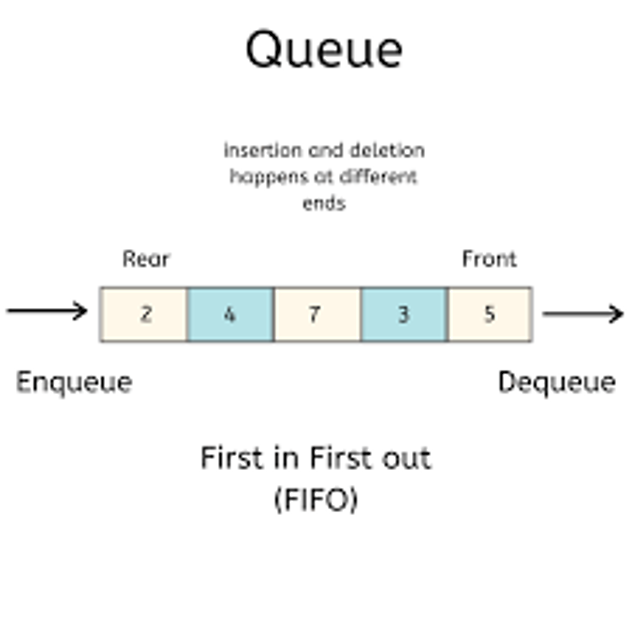

	
# Queue
## Introduction
A Queue is the opposite of a stack. A Stack is “Last In, First Out” however a Queue is “First In, First Out.” A Queue can be implemented using a python list. A Queue is used when you want things to happen in the order they were called. A queue data structure is important because is can be used for when things don’t have to be processed right away, but do have to stay in the first in first out order. 



## Dequeue and Enqueue 
The easiest way to imagine the process of how a queue function works is to imagine a line at the grocery store to checks out. The is the front of the line and the back of the line. As people check out their groceries at the front of the line, there are people continuing to enter the line at the back and the line empties and fills continuously. When the person at the front of the line checks out and leaves the line this is an example of a dequeue operation. When someone joins the back of the line this is an example of an enqueue operation.

## Queues in Python
When using python a queue can be represented using a list. The user can dequeue an item from the queue by using , [0] and del. This operation obtains the front item of the list by accessing the index and then the del removes the item from the list/queue. The user can enqueue an item to the back of the list by using the appended function.  The size of the queue can be found by using the len function. The performance of the queue using a python list is based on the performance of the dynamic array.

There is also a class in the python library called deque. This function stands for double ended queue and has a better performance. There is also better dequeue function performance when a queue is used with a linked list instead of a dynamic array. Since there is typically a reference for the first and last element in a queue the enqueue and dequeue function can be performed in constant time O(1).

Queue Operation | Description | Python Code
-------- | -------- | --------
enqueue(value) | Adds "value" to the back of the queue| my_queue.append(value)
dequeue()| Remove and return the item from the front of the queue; or pop off index 0 | value = my_queue[0] del my_queue[0] or value = my_queue.pop(0)
size()| Return the size of the queue | length = len(my_queue)
empty() | Returns true if the length of the queue is zero. | if len(my_queue) == 0:

## Testing
Testing is a process of demonstrating specific scenarios will result and then compare the results with expected outcomes. It is always important to implement as many test case scenarios as possible to ensure your code doesn’t have any bugs. Testing can also help a programmer better understand the requirements of the software.

## Example problem
### creating a queue

```python

from collections import deque

my_queue = deque()
my_queue.append(5) #the append function is what enqueues an item to the queue
my_queue.append(10)
my_queue.append(15)
my_queue.append(20)
my_queue.append(25)
print(my_queue)
print(my_queue.popleft()) # the pop function dequeues an item from the front of the queue
print(my_queue)


```
#### Practice Problem: Given a positive number n, efficiently generate binary numbers between 1 and n using the queue data structure in linear time.

[Welcome Page](Welcome.md)
